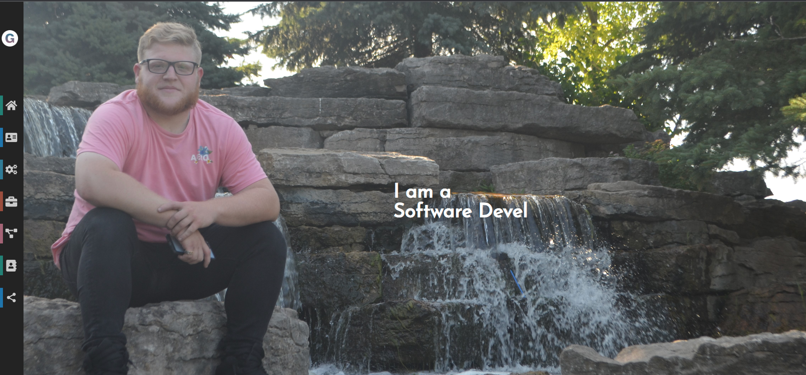

# Portfolio

## Table of Contents

- [Overview](#overview)
- [Built With](#built-with)
- [Features](#features)
- [Contact](#contact)
- [Acknowledgements](#acknowledgements)

## Overview

This is my personal portfolio website built using React. It showcases my projects, skills, and experience to potential employers or clients. Here a link to my portfolio, [ggruenspan.ca](https://ggruenspan-portfolio.netlify.app), its currently being hosted on netlify.com.

Overall, creating this portfolio was a great learning experience for me. It allowed me to practice my React skills and gain a deeper understanding of front-end web development. I also learned how to structure a portfolio website effectively to highlight my work and provide a great user experience.

Some of the technical things that I learned or improved on during this project include:
- React components and component composition  
- Responsive design using CSS media queries
<!-- Routing and navigation using React Router -->
- Integrating third-party libraries or frameworks

If you're attempting to create a similar portfolio or project, here are a few tips and guidance:
- Plan your website structure and content before starting the development process.
- Use a responsive design approach to ensure your portfolio looks great on different devices.
- Showcase your best work and provide clear descriptions or explanations for each project.
- Include your contact information and links to relevant social media profiles.
- Regularly update your portfolio with new projects or skills to keep it current.

### Built With

- React - A JavaScript library for building user interfaces.
- Jquery - A fast and lightweight JavaScript library designed to simplify DOM manipulation and event handling in web development.
- React-icons - A library that provides a collection of customizable icons for React applications.
- React-scroll - A library that provides smooth scrolling functionality to React applications.

## Features

My portfolio website aims to solve the following user problems:

- Provide an overview of my skills, experience, and projects.
- Showcase my work with project descriptions, screenshots, and links.
- Offer a way for potential employers or clients to contact me easily.

## Contact

You can connect with me through the following professional social media platforms:

- [LinkedIn](https://www.linkedin.com/in/ggruenspan/)

Feel free to reach out if you have any questions or inquiries!

## Acknowledgements

I would like to acknowledge the following resources that had a significant impact on completing this project:

- [React Documentation](https://react.dev/learn) - The official documentation provided a comprehensive guide to React development.
- [Stack Overflow](https://stackoverflow.com/) - The community-driven Q&A platform helped me overcome specific challenges during the development process.

I'm grateful for these resources as they contributed to enhancing my skills and knowledge in React development.
